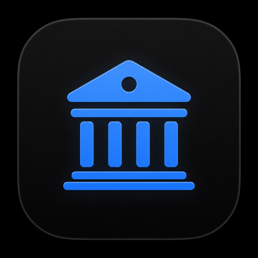
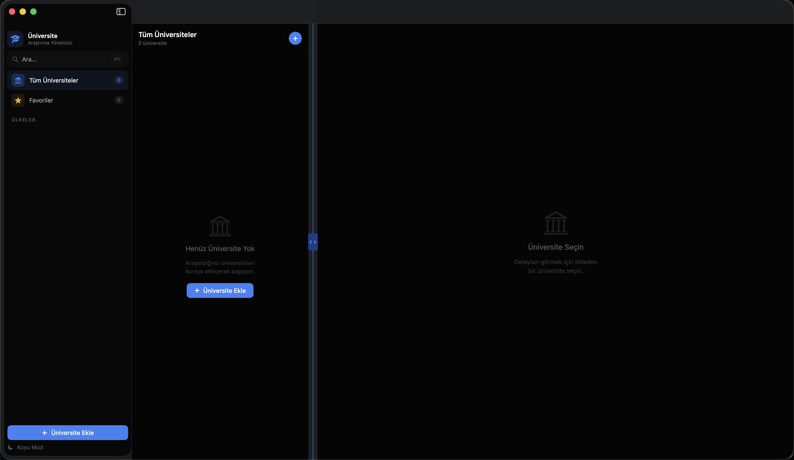

  

# Üni Başvurum

Üni Başvurum, üniversite araştırma sürecini daha düzenli yönetmek için geliştirilmiş bir macOS uygulamasıdır.

Kullanıcılar araştırdıkları üniversiteleri, bölümleri, başvuru bağlantılarını, gereksinimleri ve kişisel notlarını tek bir yerde saklayabilir.

## Özellikler

* Üniversite kayıtları oluşturma
* Ülkelere göre gruplama
* Başvuru bağlantıları ekleme
* Gereksinim takibi (IELTS, TOEFL vb.)
* Üniversite notları oluşturma
* Favori üniversiteleri işaretleme
* Hızlı arama ve filtreleme
* Otomatik favicon/logo çekme
* SwiftData ile yerel veri saklama

## Teknolojiler

* Swift
* SwiftUI
* SwiftData
* macOS

## Ekran Görüntüsü

## Amaç

Bu proje, üniversite araştırma sürecinde farklı kaynaklardan toplanan bilgileri tek bir yerde organize etmek amacıyla geliştirilmiştir.
